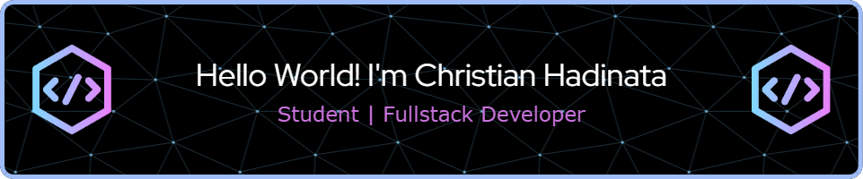

### 🌐 Socials:

 

### 💻 Tech Stack:

                                       

### 📊 GitHub Stats:

 
 

<picture>
  <source media="(prefers-color-scheme: dark)" srcset="https://raw.githubusercontent.com/christianHadinata/christianHadinata/output/pacman-contribution-graph-dark.svg">
  <source media="(prefers-color-scheme: light)" srcset="https://raw.githubusercontent.com/christianHadinata/christianHadinata/output/pacman-contribution-graph.svg">
  
</picture>

<!-- ###

### -->
